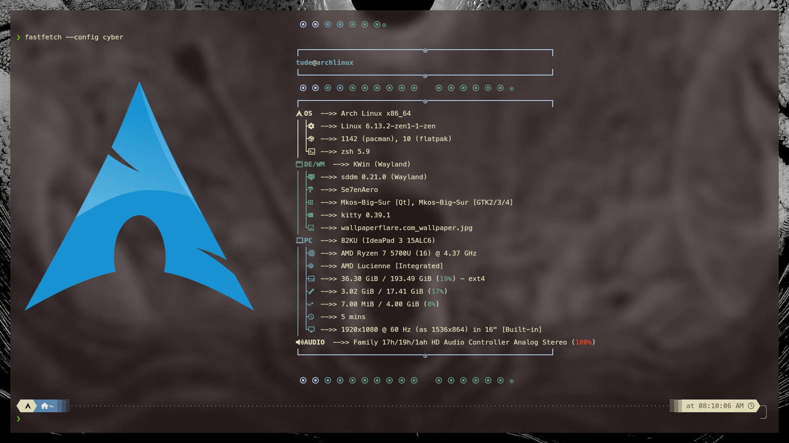

# Fastfetch Configuration

This repository contains my custom configuration for Fastfetch



## Usage

To use this configuration, place the in `~/.local/share/fastfetch/presets` -> `cyber.jsonc` file in the appropriate directory and run Fastfetch:

```sh
fastfetch --config cyber
```
